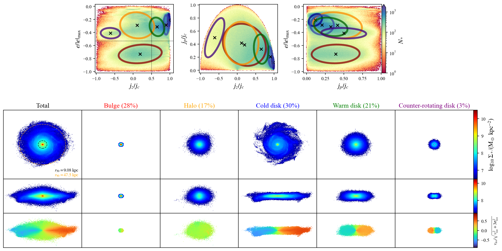
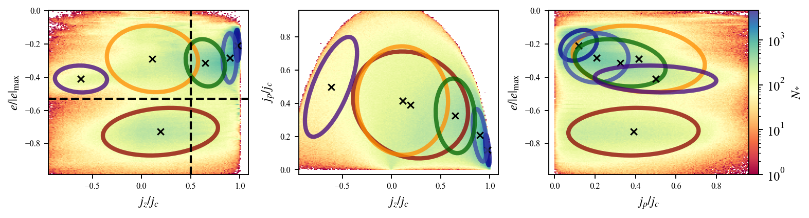
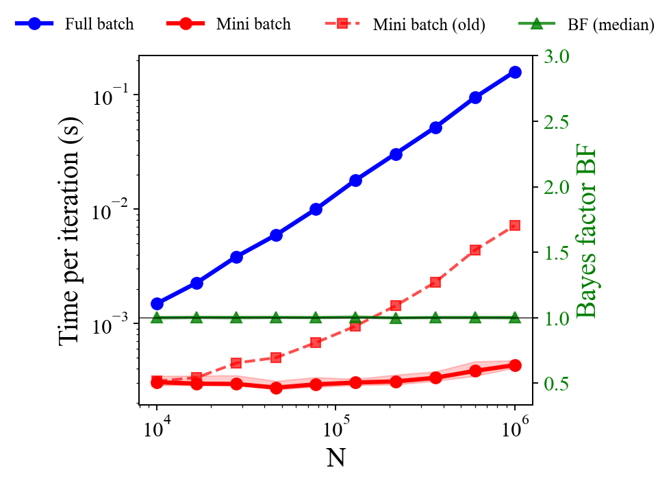

# kinematic-decompose — 星系运动学自动分解

**基于自适应高斯混合模型（AutoGMM）的星系运动学结构自动分解工具。**

本工具提供了一套端到端的管线（pipeline），用于将宇宙学模拟（如 IllustrisTNG）中的星系自动分解为五个运动学子结构：**冷盘**（cold disk）、**温盘**（warm disk）、**核球**（bulge）、**恒星晕**（stellar halo）和**反向旋转盘**（counter-rotating disk），核心算法为**自适应高斯混合模型（AutoGaussianMixtureModel）**。



## 概述

传统的运动学分解方法（如 Abadi + JEHistogram）依赖人为设定的能量和角动量截断阈值。本工具用**自适应的数据驱动型高斯混合模型**替代了硬截断：

1. **自动分类星系形态** — 在 ($e/|e_{\min}|$, $j_z/j_c$) 相空间上拟合 3 分量 GMM，自动判断星系是盘主导还是球状主导。
2. **物理启发的初始化** — 利用能量 ($e/|e_{\min}|$) 和圆度 ($j_z/j_c$) 阈值，为核球、恒星晕、冷盘、温盘和反向旋转盘分别初始化高斯分量。
3. **残差自动检测** — 利用基于 2D 直方图的 $\Delta L$ 判据，自动识别当前混合模型拟合不足的相空间区域，并新增高斯分量。
4. **支持软/硬分类** — 可以概率赋值或硬赋值两种方式将每颗恒星标记到五个运动学类别。

### 运动学相空间

分解基于恒星轨道的三个相空间维度：

| 变量 | 定义 | 说明 |
|------|------|------|
| $e/|e_{\min}|$ | $E/|E_{\min}|$ | 轨道能量除以最小（最束缚）能量的绝对值；束缚粒子落在 $[-1, 0)$ |
| $j_z/j_c$ | $L_z / L_c(E)$ | 圆度：角动量 $z$ 分量与同能量下圆轨道角动量之比 |
| $j_p/j_c$ | $L_p / L_c(E)$ | 垂直方向角动量分数 |

<p align="center">
  
</p>

### 子结构成分

| 成分 | 相空间特征 |
|------|-----------|
| **冷盘** (Cold disk) | $j_z/j_c > 0.85$ |
| **温盘** (Warm disk) | $j_z/j_c > 0.5$ |
| **核球** (Bulge) | $e/|e_{\min}| < e_{\mathrm{cut}}$ 且 $|j_z/j_c| < 0.5$ |
| **恒星晕** (Stellar halo) | $e/|e_{\min}| > e_{\mathrm{cut}}$ 且 $|j_z/j_c| < 0.5$ |
| **反向旋转盘** (Counter-rotating disk) | $j_z/j_c < -0.5$ |

其中 $e_{\mathrm{cut}}$ 根据引力势和恒星能量分布自适应确定；圆度阈值固定为 0.5。

## 项目结构

```
kinematic-decompose/
├── src/kinematic_decompose/
│   ├── __init__.py                      # 入口
│   ├── config.py                        # TNG 模拟数据路径和默认参数
│   ├── pipeline.py                      # 端到端分解管线
│   ├── visualize.py                     # 出版物级别可视化（相空间、面密度、视向速度图）
│   ├── mixture/
│   │   ├── __init__.py
│   │   ├── _base.py                     # 混合模型基类（源自 scikit-learn）
│   │   ├── _gaussian_mixture.py         # 高斯混合模型（扩展了 soft_predict 等）
│   │   ├── _auto_gaussian_mixture.py    # **AutoGaussianMixtureModel** — 核心算法
│   │   ├── preprocessing.py             # RobustScaler 相空间标准化
│   │   └── util.py                      # JEHistogram、Ecut、分解、结构属性保存
│   ├── gravity/
│   │   └── kinematic_solver.py          # Agama 多极展开势 + 运动学参数计算
│   └── PyTNG/
│       ├── snapshot_loader.py           # TNG 快照加载器（基于 pynbody）
│       ├── derived_array.py             # 派生数组（能量、角动量等）
│       ├── extension.py                 # pynbody 扩展（盘/球状粒子筛选、结构属性）
│       ├── tng_config.py                # TNG 模拟配置
│       ├── simdict_getter.py            # 模拟字典字段辅助
│       └── illustris_python/            # 底层 TNG I/O 函数
├── tests/
│   └── example_kinematic_decomposition.ipynb  # 示例 notebook
├── image/                               # 输出和参考图像
├── IDEA.md                              # 开发笔记
├── pyproject.toml
├── README.md                            # 英文版 README
└── README.zh-CN.md                      # 中文版 README（本文件）
```

## 安装

### 系统要求

- Python ≥ 3.11
- [Agama](https://github.com/GalacticDynamics-Oxford/Agama)（星系动力学库）
- [pynbody](https://pynbody.github.io/)（N-body/SPH 快照分析）
- [IllustrisTNG](https://www.tng-project.org/) 模拟数据访问权限

### 使用 uv 安装

```bash
uv pip install -e .
```

在 macOS 上，如果 Agama 通过 Homebrew 安装，可能需要设置：

```bash
export DYLD_LIBRARY_PATH=/opt/homebrew/opt/libomp/lib
```

## 使用示例

### 快速开始

```python
from kinematic_decompose.pipeline import kinematic_decomposition_pipeline

model, galaxy, eoemin_cut, jzojc_cut = kinematic_decomposition_pipeline(
    run='TNG50-1',
    snapNum=99,
    subID=307486,
    gravity_potential_path='./potentials/',
    image_path='./images/',
    structure_properties_output_path='./properties/',
    mixture_model_output_path='./models/',
)
```

### 分步说明

详细示例见 [`tests/example_kinematic_decomposition.ipynb`](tests/example_kinematic_decomposition.ipynb)。

```python
from kinematic_decompose.PyTNG.snapshot_loader import Snapshot
from kinematic_decompose.gravity.kinematic_solver import (
    construct_galaxy_potential_model, calculate_kinematic_param
)
from kinematic_decompose.mixture import AutoGaussianMixtureModel, preprocessing, util
from kinematic_decompose.config import BASEPATH
from kinematic_decompose.visualize import visualize_decomposition

# 1. 从 TNG 加载星系
snapshot = Snapshot(f"{BASEPATH}/TNG50-1/output", snapNum=99)
snapshot.load_particle(ID=307486, load_particle_fields='default')
snapshot.physical_units()
snapshot.load_group_catalog(ID=307486)
snapshot.GC_physical_units()
snapshot.center(cen=snapshot.group_catalog['SubhaloPos'])
snapshot.faceon(align_with='star', range=[3*snapshot.properties['eps'], 5*snapshot.s.r50])

# 2. 构建引力势（Agama Multipole）
pot = construct_galaxy_potential_model(galaxy)

# 3. 计算运动学参数（φ, j_c, e/|e|_max, j_z/j_c, j_p/j_c）
galaxy = calculate_kinematic_param(galaxy, potential=pot)

# 4. 构建训练数据
X = np.column_stack([galaxy.s['eoemin'], galaxy.s['jzojc'], galaxy.s['jpojc']])
keep = (galaxy.s['eoemin'] < 0) & (np.abs(galaxy.s['jzojc']) < 1.5) & (galaxy.s['jpojc'] < 1.5)

# 5. 确定能量截断
sph, _ = util.JEHistogram(galaxy.s['eoemin'][keep], galaxy.s['jzojc'][keep])
eoemin_cut = util.get_Ecut(galaxy.s['eoemin'][keep][sph], galaxy.s['mass'][keep][sph])

# 6. 标准化并运行 AutoGMM
scaler = preprocessing.RobustScaler()
X_train = scaler.fit_transform(X[keep])
auto_gmm = AutoGaussianMixtureModel()
auto_gmm.fit(X_train, eoemin_cut=scaler.transform(eoemin_cut, columns=0),
             jzojc_cut=scaler.transform(0.5, columns=1),
             r_jzojc_cut=scaler.transform(-0.5, columns=1),
             sample_weight=galaxy.s['mass'][keep])
best_model = scaler.inverse_transform_GMM(auto_gmm.best_model)

# 7. 进行运动学分解
galaxy = util.decompose(X, galaxy, best_model, eoemin_cut, jzojc_cut, predict_method='hard')

# 8. 可视化
visualize_decomposition(X, best_model, galaxy, eoemin_cut, jzojc_cut, threshold_line=True)
```

## 算法原理：自适应高斯混合模型（AutoGMM）

本包的核心是一个**自适应** GMM：不对分量数量做先验假设，而是**从数据中自动发现运动学结构**——先分类形态，再自动检测当前混合模型欠拟合的残差相空间区域并加入新分量，直到模型充分拟合。**分量数量由数据决定，而非人工指定**。

`mixture/_gaussian_mixture.py` 中的自定义 `GaussianMixture` 在 scikit-learn 的基础上增加了以下功能：

- **`soft_predict(X)`**：基于责任度（responsibility）的概率标签分配
- **`sample_weight` 支持**：质量加权拟合
- **`min_iter`**：收敛检查前的最少迭代次数保障
- **完整精度矩阵初始化**：支持用户传入 `precisions_init`

### AutoGMM 的四个拟合阶段

1. **形态分类** `— _morphology_class()`：在 ($e/|e_{\min}|$, $j_z/j_c$) 上拟合 3 分量 GMM。若任一分量的 $\mu_{j_z/j_c} > \text{cut}$，则星系分类为 `'disk'`，否则为 `'spheroid'`。

2. **物理初始化** `— _initialize()`：利用能量和圆度阈值将 GMM 分量映射到核球、晕、盘子群。当某个形态子群缺失时，自动退化为基于数据的统计初始化。

3. **残差分量自动检测** `— _find_residual_component()`：核心创新点。
   - 在 ($e/|e_{\min}|$, $j_z/j_c$) 上构建真实数据的 2D 直方图
   - 从当前 GMM 计算模型预测密度
   - 计算 $\Delta L = \text{真实}\cdot\log(\text{真实}/\text{模型}) - (\text{真实} - \text{模型})$（似然比残差）
   - 对异常值区域做阈值分割，为每个区域估计新的高斯分量
   - 使用类似 BIC 的增益判据选择保留哪些新分量

4. **最终 EM 拟合**：以自动确定的分量数和初始化运行完整 GMM。

## 依赖

| 包 | 最低版本 | 用途 |
|------|----------------|--------|
| `agama` | ≥ 1.0.0 | 引力势（多极展开） |
| `numpy` | ≥ 2.4.0 | 数值计算 |
| `scipy` | ≥ 1.17.0 | 统计、插值、优化 |
| `scikit-learn` | ≥ 1.8.0 | GMM 基础实现 |
| `scikit-image` | ≥ 0.26.0 | 图像处理（label, watershed） |
| `pynbody` | ≥ 2.4.0 | 模拟快照分析 |
| `pandas` | ≥ 3.0.0 | 数据结构（可选，用于输出） |
| `matplotlib` | ≥ 3.10.0 | 可视化 |
| `pytest` | ≥ 9.0.0 | 测试 |

## 可视化

`visualize.py` 生成出版物质量的多面板图表：

- **相空间**（顶部行）：（$j_z/j_c$, $e/|e_{\min}|$）、（$j_z/j_c$, $j_p/j_c$）、（$j_p/j_c$, $e/|e_{\min}|$）的 2D 直方图，叠加按成分配色的高斯椭圆。
- **面密度**（中间行）：各成分的恒星面密度投影图（$\log_{10} \Sigma_*$），包含正面和侧向视图。
- **视向速度图**（底部行）：各成分的恒星视向速度图（$v_{\text{los}} / \sqrt{v_{\text{los}}^2 + 3\sigma_{\text{los}}^2}$）。

## 性能：Mini-Batch vs Full-Batch EM

`GaussianMixture` 支持 **单次迭代耗时与粒子总数无关的 mini-batch EM**：成本只依赖 `batch_size`，而非 N。Full-batch EM 每次迭代必须扫描全部粒子（每迭代 O(N)）；mini-batch EM 只在固定大小的批次上计算（每迭代 O(batch)）。

| | Full-batch | Mini-batch |
|---|---|---|
| 单次迭代成本 | O(N) | **O(batch)——与 N 无关** |
| 单次迭代耗时 @ N = 10⁴ | 1.5 ms | 0.4 ms |
| 单次迭代耗时 @ N = 10⁷ | 3.79 s | **1.9 ms（约快 2000×）** |
| N 从 10⁴ 增至 10⁷（×1000）的成本增长 | ×2500 | **×5** |
| 收敛后 lower bound | 基准 | 偏差 < 0.5%（迭代数一致） |

<p align="center">
  
</p>

核心机制是**基于统计功效的有界子采样初始化**：初始参数在大小为

$$S = \frac{K \cdot d(d+1)}{2\varepsilon^2}, \qquad \varepsilon = 0.05,$$

的随机子样本上估计（协方差估计量约 5% 相对精度），初始化成本同样与 N 无关。缩放行为由 `tests/example_gaussian_mixture.py::test_scaling_with_n_samples` 验证（N = 10⁴–10⁶、固定 10 次迭代、每个 N 的 mini-batch 重复 10 次：中位数曲线 + 16–84% 误差带）。右侧轴显示 full 与 mini 收敛解的**贝叶斯因子** BF = exp(ΔLB)（对数刻度，N 抵消），纵轴范围覆盖 Jeffreys "轶闻级"区 [1/3, 3]。实测 BF ≈ 1（本次运行 0.96–1.01）——**无证据表明两者存在差异**：两条收敛路径在统计上不可区分，而非仅仅"接近"。

除 EM 外，端到端 pipeline（TNG50-1、514 万恒星——自动分量选择、运动学分解、出版级可视化）总耗时 **22 s**（原 37 s）。

## 可视化风格

所有图统一采用 **Nature 期刊风格**（`visualize.py` 中的 `NATURE_STYLE`）：无衬线 Helvetica/Arial、克制的字号、细轴线、无网格、300 dpi 输出。面密度与视向速度图使用 O(N) 的 `searchsorted` + `bincount` 分箱（无 `lexsort` 排序），并在 PDF 输出中位图化，保持文件体积小巧。

## 测试

```bash
python -m pytest tests/example_gaussian_mixture.py tests/example_eoemin_cut.py -q
```

- `tests/example_eoemin_cut.py` — 21 个测试，锁定能量截断算法在 19 个合成场景（有谷、无缝、均匀、噪声等）下的行为，含 TRUE（绿虚线）/ DETECTED（红实线）叠加可视化。
- `tests/example_gaussian_mixture.py` — GMM/AutoGMM 行为测试及上述 N 缩放基准。

## 引用

若本代码对您的研究有帮助，请引用相关文献：

- **AutoGMM 方法**：（待发表时补充）
- **IllustrisTNG**：Nelson et al. 2019, [CompAC, 6, 2](https://ui.adsabs.harvard.edu/abs/2019ComAC...6....2N)
- **Agama**：Vasiliev 2019, [MNRAS, 482, 1525](https://ui.adsabs.harvard.edu/abs/2019MNRAS.482.1525V)
- **pynbody**：Pontzen et al. 2013, [ApJS, 239, 39](https://ui.adsabs.harvard.edu/abs/2018MNRAS.473.4025P)

## 许可证

本项目基于 BSD-3-Clause 许可证。`mixture/_gaussian_mixture.py` 和 `mixture/_base.py` 中的 GMM 实现源自 scikit-learn（BSD-3-Clause）。
